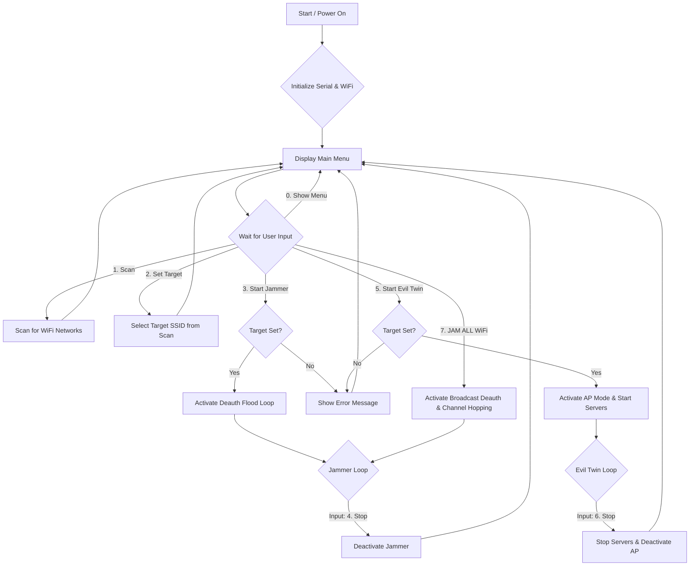
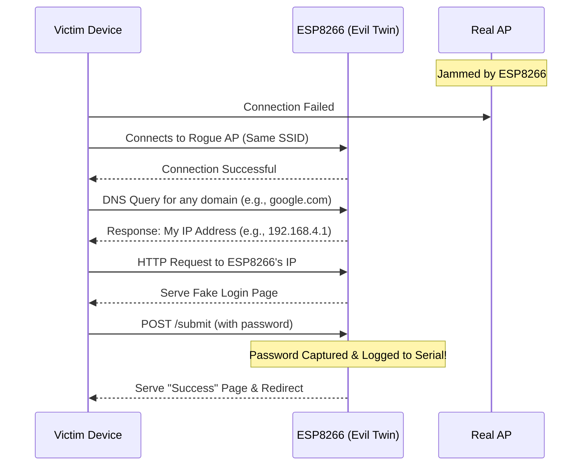

# Project Flowcharts

This file contains the Mermaid syntax for the flowcharts used in the project introduction. You can paste this code into any Mermaid-compatible viewer (like the Markdown preview in VS Code or online editors) to render the diagrams.

---

## System Flowchart

This chart illustrates the main operational loop of the device, driven by user commands from the serial interface.

---

## Evil Twin Attack Flow Diagram

This sequence diagram shows the step-by-step interaction between a victim, the ESP8266 (acting as an Evil Twin), and the real access point during a credential harvesting attack.

